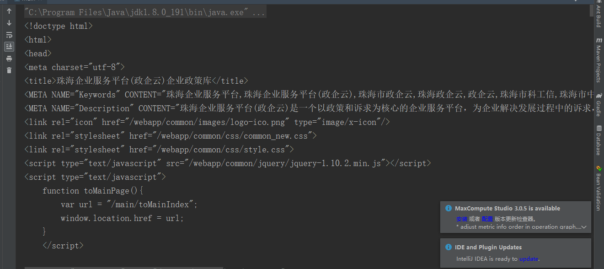

# 一、Jsoup
爬虫的基本使用

## 1、什么是爬虫 

· **爬虫**（crawler）又称为网页蜘蛛（spider），或是网络机器人，是一种按照一定的规则，自动地抓取网络信息的程序或脚本。
  还有一些不常用的名字蚂蚁、自动索引、模拟程序。

## 2、java实现爬虫

· 在java中实现爬虫很简单我们只要只要实现一个**RULConnection**接口就可以
· 例子： 爬出珠海政企云的首页

	 try {
			//获取一个url
            URL url = new URL("http://www.zhsme.gov.cn/policy/getPolicyList");
            //使用一个url调用openConnection打开连接的方法
			URLConnection connection = url.openConnection();
			//可以得到一个输入流
            InputStream is = connection.getInputStream();
            //System.out.println(inputStream.read());
			//创建一个BufferedReader读取流中的信息
            BufferedReader br = new BufferedReader(new InputStreamReader(is));
			
			//ready()有东西返回一true
            while (br.ready()) {
				//显示这个html页面到控制台
                System.out.println(br.readLine());
            }
            //String restr = "你好，主机已经收到信息！";
        } catch (MalformedURLException e) {
            e.printStackTrace();
        } catch (IOException e) {
            e.printStackTrace();
        }

· 3、显示结果

## RULConnection接口上，有许多的夹包，如：

-- Jsoup  
-- HttpClient（apache）
-- OkHttp
